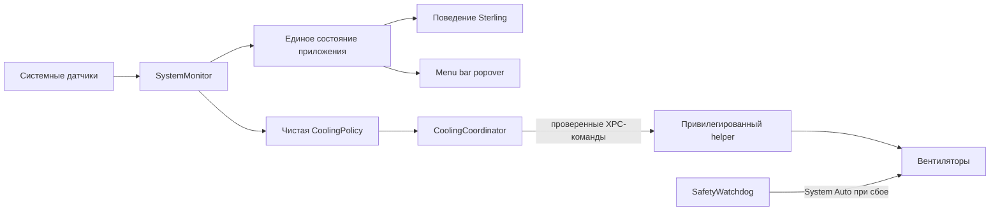

# Техническое задание: Tama 0.1

Статус: каноническая спецификация первой версии

Дата фиксации: 17 августа 2026 года

Рабочее название продукта: **Tama**

Питомец: **Sterling**

## 1. Статус документа

Этот файл — основной источник требований для проектирования, реализации, тестирования и приемки Tama 0.1.

Если переписка, прототип, README или существующий код противоречат этому документу, приоритет имеет этот документ. Изменение продуктового поведения сначала фиксируется здесь, затем реализуется в коде. Версия 0.1 считается завершенной только после выполнения всех обязательных критериев приемки из раздела 18.

Существующий прототип с показателями сытости, радости и энергии не определяет целевую архитектуру и поведение продукта. Его можно использовать только как временную техническую заготовку.

## 2. Определение продукта

Tama — нативная утилита для macOS с живым котом на рабочем столе. Кот одновременно выполняет две функции:

1. создает ощущение присутствия питомца: отдыхает, реагирует на пользователя, играет с курсором;
2. без навязчивых графиков показывает состояние Mac: загрузку CPU, нагрев, работу вентиляторов и режим охлаждения.

Главная особенность продукта — системные показатели выражаются не только числами, но и поведением кота. Пользователь должен понимать общее состояние Mac, бросив взгляд на Sterling, а точные значения получать через меню в строке состояния.

Tama 0.1 не является симулятором ухода за животным. Кот не голодает, не болеет из-за отсутствия внимания и не наказывает пользователя уведомлениями.

## 3. Цели версии 0.1

Версия должна доказать четыре вещи:

- Sterling естественно живет поверх рабочего стола и не мешает работе;
- наблюдение за курсором безопасно и не изменяет пользовательский ввод;
- системные показатели корректно считываются и понятно отражаются в интерфейсе;
- опциональное интеллектуальное охлаждение способно заранее повышать обороты вентиляторов на проверенной модели Mac и гарантированно возвращать управление macOS при любой ошибке.

## 4. Принципы продукта

- **Сначала питомец.** Основное лицо приложения — Sterling, а не панель мониторинга.
- **Спокойствие по умолчанию.** Никаких частых уведомлений, резких анимаций и тревожных цветов без реальной причины.
- **Безопасность оборудования важнее функции.** При сомнении приложение возвращает вентиляторы в режим macOS System Auto.
- **Нулевое вмешательство в курсор.** Tama только наблюдает координаты и активность указателя; приложение никогда не перемещает, не блокирует и не подменяет его.
- **Локальность.** Для базовой работы не нужны аккаунт, облако, телеметрия или сеть.
- **Минимальная нагрузка.** Питомец и мониторинг не должны сами заметно нагружать Mac.
- **Честная совместимость.** Управление вентиляторами доступно только на моделях, профиль которых физически проверен.

## 5. Границы версии

### 5.1. Обязательные функции

- один анимированный кот Sterling поверх окон;
- показ, скрытие и автоматический запуск питомца;
- пассивная реакция на курсор и короткая охота после бездействия;
- меню в строке состояния macOS;
- мониторинг общей загрузки CPU;
- мониторинг валидированных температурных датчиков;
- отображение фактических и целевых оборотов вентиляторов;
- отображение системного thermal state;
- три режима охлаждения: System Auto, Balanced, Performance;
- безопасный привилегированный helper для управления вентиляторами;
- настройки видимости, масштаба, полноэкранного режима, охлаждения и запуска при входе;
- локальная диагностика без передачи данных наружу;
- поддержка доступности и Reduce Motion.

### 5.2. Не входит в версию 0.1

- голод, болезни, кормление, наказание за отсутствие внимания;
- погода, календарь, встречи и напоминания;
- ИИ-ассистент и чат;
- мониторинг памяти, диска, сети и батареи как отдельные продуктовые модули;
- очистка файлов, антивирус и завершение процессов;
- ручная установка фиксированных RPM;
- редактор пользовательской кривой вентиляторов;
- несколько питомцев, смена скинов и магазин контента;
- синхронизация между устройствами;
- Mac App Store;
- управление вентиляторами на непроверенных моделях Mac.

Эти возможности могут рассматриваться только после стабильного выпуска 0.1 и не должны усложнять первую архитектуру заранее.

## 6. Канонический образ питомца

### PET-01. Персонаж

Единственный питомец версии 0.1 — Sterling: серебристый британский котенок с голубыми глазами в чистом плоском векторном стиле. Менять породу, пропорции головы и тела, рисунок шерсти, цвет глаз или визуальный язык между состояниями нельзя.

Исходный пакет персонажа:

- идентификатор: `sterling`;
- версия формата: `spriteVersionNumber: 2`;
- исходный атлас: `spritesheet.webp`;
- сетка: 8 столбцов × 11 строк;
- размер кадра: 192 × 208 px;
- размер атласа: 1536 × 2288 px;
- фон: прозрачный.

Перед включением в приложение ассеты Sterling копируются в репозиторий и становятся частью ресурсов целевого приложения. Внешний пользовательский каталог не является runtime-зависимостью продукта.

### PET-02. Базовые анимации

Приложение использует существующие группы кадров:

- ожидание и спокойное дыхание;
- движение вправо;
- движение влево;
- приветствие лапой;
- прыжок;
- предупреждение или ошибка;
- ожидание события;
- активная работа;
- наблюдение;
- направление взгляда в 16 направлениях.

Для 0.1 создается один дополнительный клип `cooling`: Sterling сидит рядом с компактным вентилятором, шерсть и усы слегка реагируют на поток воздуха. Требования к клипу:

- 8 кадров;
- каждый кадр 192 × 208 px;
- прозрачный фон;
- неизменная внешность Sterling;
- бесшовный цикл без заметного скачка;
- никаких надписей внутри изображения.

## 7. Поведение кота на рабочем столе

### PET-03. Окно питомца

- Кот отображается в прозрачном неактивирующем `NSPanel` без рамки и заголовка.
- Панель находится поверх обычных окон, но не перехватывает фокус клавиатуры.
- Вне видимого силуэта кота клики проходят в расположенное ниже приложение.
- Клик по видимой части Sterling запускает приветствие лапой и не открывает главное окно.
- Приложение не показывает иконку в Dock. Управление выполняется через строку состояния macOS.
- В системе существует только один экземпляр кота.
- Начальная позиция выбирается на свободном участке у нижнего края видимой области активного дисплея с безопасным отступом от Dock, границ экрана и обычных окон.
- Позиция всегда ограничивается `visibleFrame` текущего дисплея.
- По умолчанию кот доступен на всех Spaces.
- При переходе указателя на другой дисплей кот завершает текущую охоту, затем мягко появляется у нижнего края нового активного дисплея.
- В полноэкранных приложениях кот по умолчанию скрывается. Поведение можно изменить в настройках.

### PET-04. Показ и скрытие

Пользователь может в любой момент:

- скрыть или показать Sterling из меню строки состояния;
- приостановить движение, сохранив отображение статичного кота;
- отключить автоматическое появление в полноэкранном режиме;
- полностью вернуть охлаждение в System Auto независимо от видимости кота.

Скрытие кота не выключает мониторинг. Выход из приложения выключает мониторинг и освобождает управление вентиляторами.

### PET-05. Охота за курсором

Охота запускается только при одновременном выполнении условий:

1. пользователь не двигал указатель не менее 30 секунд;
2. после паузы указатель сместился более чем на 80 pt за 0,5 секунды;
3. приложение не находится в cooldown;
4. нет состояния серьезного или критического нагрева;
5. движение не приостановлено пользователем или системной настройкой Reduce Motion.

Поведение охоты:

- Sterling движется к текущей позиции курсора, не воздействуя на сам курсор;
- максимальная скорость — 420 pt/s;
- максимальное ускорение — 900 pt/s²;
- направление спрайта соответствует направлению движения;
- охота длится не более 8 секунд;
- при расстоянии до курсора 28 pt или меньше кот выполняет прыжок и останавливается;
- если курсор покидает дисплей, охота завершается;
- после завершения действует cooldown 45 секунд;
- новая охота не запускается во время пользовательского клика по коту или системного предупреждения.

Запрещено использовать API синтеза событий, менять изображение курсора, фиксировать указатель, перетаскивать окна или выполнять клики от имени пользователя.

### PET-06. Приоритет состояний

Когда несколько событий происходят одновременно, применяется такой порядок, от самого важного к обычному:

1. критический thermal state;
2. серьезный thermal state и максимальное охлаждение;
3. активная сессия Smart Cooling;
4. ошибка мониторинга или helper;
5. длительная высокая загрузка CPU;
6. охота и прыжок;
7. приветствие по клику;
8. ожидание, взгляд и спокойное дыхание.

Состояние более высокого уровня прерывает анимацию более низкого. После завершения система пересчитывает состояние заново, а не продолжает устаревшую анимацию.

### PET-07. Размер и спокойное движение

Sterling не должен перекрывать заметную часть рабочего контента или постоянно привлекать внимание резкой анимацией.

- базовый экранный размер при масштабе 100% — 128 × 139 pt;
- варианты 75% и 125% вычисляются относительно базового экранного размера, а не размера исходной ячейки атласа;
- спокойная анимация выполняет один короткий цикл, затем сохраняет устойчивый кадр не менее 2,5 секунды;
- смена кадров спокойной анимации смягчается переходом длительностью около 100 мс;
- при включенном Reduce Motion отображается устойчивый статичный кадр без циклической анимации;
- изменение масштаба не должно вызывать скачок позиции относительно выбранного края экрана.

Изменение решает проблему перекрытия рабочего контента и визуального мельтешения. Оно не влияет на управление курсором, аппаратную безопасность, приватность или сетевое поведение. Приемка подтверждается тестами базового размера и ритма idle-анимации, а также ручной проверкой всех трех масштабов на рабочем столе.

### PET-08. Безопасное перемещение по экрану

В спокойном состоянии Sterling может перемещаться вдоль нижней части активного дисплея, не закрывая содержимое видимых окон.

- перед каждым перемещением приложение получает границы обычных видимых окон через read-only Window Server API;
- окна других приложений считаются препятствиями с дополнительным безопасным отступом 12 pt;
- путь выбирается только внутри одного непрерывного свободного горизонтального участка, поэтому Sterling не проходит сквозь занятое окно;
- спокойная скорость перемещения не превышает 70 pt/s;
- между самостоятельными перемещениями проходит не менее 4 секунд;
- если свободного участка размером с Sterling нет или границы окон получить не удалось, питомец временно скрывается и повторяет безопасную проверку через 5 секунд;
- при паузе движения или Reduce Motion питомец остается статичным на безопасном участке;
- приложение не использует Accessibility API для чтения содержимого окон и не анализирует текст, изображения или пользовательские данные внутри них.

Изменение заменяет постоянную привязку к правому углу безопасным блужданием и предотвращает перекрытие рабочего контента. Оно не влияет на аппаратное управление, сеть или ввод пользователя. Приемка подтверждается детерминированными тестами свободных сегментов, препятствий и отсутствия маршрута, а также ручной проверкой перемещения при открытии, закрытии и перемещении окон.

## 8. Меню в строке состояния

### UI-01. Иконка

Иконка строки состояния — монохромный силуэт головы Sterling, корректно работающий в светлой и темной темах. Иконка не должна постоянно анимироваться.

### UI-02. Popover

По нажатию открывается компактная панель со следующими данными:

- миниатюра Sterling и текстовое описание текущего состояния;
- общая загрузка CPU в процентах;
- самый горячий валидированный датчик и его температура;
- thermal state: nominal, fair, serious или critical с понятной локализованной подписью;
- фактические обороты каждого доступного вентилятора;
- целевые обороты во время управления;
- текущий режим: System Auto, Balanced или Performance;
- при длительной высокой загрузке — до трех процессов с наибольшим CPU, если данные доступны без расширения привилегий.

Обязательные действия:

- показать или скрыть кота;
- открыть настройки;
- немедленно вернуть System Auto;
- выйти из приложения.

Кнопки завершения процессов в 0.1 нет.

### UI-03. Системные состояния кота

- Нормальная работа: спокойное дыхание, взгляд за курсором.
- Высокий CPU: анимация активной работы; панель показывает продолжительность нагрузки и основные процессы.
- Smart Cooling: клип `cooling` рядом с вентилятором.
- Ошибка датчика или helper: короткое предупреждение, затем спокойное состояние с диагностическим значком в popover.
- Serious: охлаждение на максимуме, частота анимации снижена.
- Critical: минимальная анимационная активность, отчетливое предупреждение и максимальное охлаждение.

## 9. Мониторинг системы

### MON-01. Загрузка CPU

- Общая загрузка нормализуется в диапазон 0–100% для всей системы, а не суммируется по ядрам выше 100%.
- Интервал выборки — 1 секунда.
- Высокая нагрузка фиксируется при CPU не ниже 85% в течение 60 секунд.
- Состояние высокой нагрузки снимается при CPU не выше 70% в течение 30 секунд.
- CPU влияет на состояние кота и интерфейс, но не является самостоятельным входом алгоритма вентиляторов.

### MON-02. Температуры

- Температуры читаются раз в 2 секунды.
- Используются только ключи датчиков, включенные в профиль конкретной модели Mac и подтвержденные физическим тестом.
- Невалидное, пропавшее, неизменное или выходящее за физически допустимый диапазон значение исключается из расчета.
- Неизвестный ключ никогда не получает управляющего значения по сходству имени.
- Для интерфейса показывается человекочитаемая группа датчика, а не внутренний SMC-ключ.

### MON-03. Вентиляторы

- Фактические и целевые RPM читаются раз в 2 секунды.
- Для каждого вентилятора известны аппаратные minimum и maximum RPM.
- Значения за пределами аппаратного диапазона считаются ошибкой.
- Отсутствие вентиляторов переводит устройство в режим только мониторинга.

### MON-04. Thermal state

Используется официальный `ProcessInfo.thermalState`. Изменение состояния обрабатывается по системному уведомлению, дополнительная проверка выполняется раз в 2 секунды.

### MON-05. Краткая история

В памяти хранится кольцевой буфер последних 15 минут для температуры, CPU и RPM. По умолчанию история не записывается на диск и очищается при завершении приложения.

## 10. Интеллектуальное охлаждение

### COOL-01. Общий принцип

macOS остается владельцем базовой терморегуляции. Tama может только временно повысить охлаждение раньше системной кривой на поддерживаемом устройстве. Приложение не должно удерживать обороты ниже текущего решения системы.

Smart Cooling отключен при первом запуске. Пользователь явно выбирает Balanced или Performance и подтверждает установку привилегированного helper.

### COOL-02. Режимы

**System Auto**

- режим по умолчанию;
- Tama не пишет управляющие значения в SMC;
- popover продолжает показывать доступные показатели.

**Balanced**

- мягкое раннее охлаждение;
- управляющее состояние должно сохраняться 10 секунд до захвата управления;
- доля диапазона RPM вычисляется как `heatScore²`.

**Performance**

- более ранняя и прямая реакция;
- управляющее состояние должно сохраняться 5 секунд до захвата управления;
- доля диапазона RPM равна `heatScore`.

### COOL-03. Первая поддерживаемая модель

Управление вентиляторами в 0.1 разрешено только для профиля `Mac16,1`, прошедшего полный аппаратный тест. На других моделях приложение работает в режиме питомца и мониторинга, а Balanced и Performance недоступны с понятным объяснением.

Поддержка модели определяется точным `model identifier`, а не маркетинговым названием. Каждый новый профиль добавляется отдельным изменением кода вместе с протоколом аппаратной проверки.

### COOL-04. Начальный профиль Mac16,1

Пороговые значения являются ранними продуктовыми порогами включения дополнительного охлаждения, а не заявлением о предельно допустимых температурах Apple:

- CPU/SoC: начало 65 °C, полный запрос 90 °C;
- GPU: начало 65 °C, полный запрос 90 °C;
- контроллер памяти: начало 60 °C, полный запрос 85 °C, только после подтверждения ключа;
- SSD/NAND: начало 55 °C, полный запрос 75 °C, только после подтверждения ключа и измерения реального влияния вентилятора.

Неподтвержденная группа исключается из релизного профиля. Значения могут быть изменены только по результатам воспроизводимого аппаратного теста с фиксацией результатов в изменении спецификации.

### COOL-05. Расчет теплового запроса

Для каждой подтвержденной группы датчиков:

1. вычисляется экспоненциально сглаженная температура с временным окном 10 секунд;
2. вычисляется нормализованный показатель:
   `score = clamp((temperatureEMA - startTemperature) / (fullTemperature - startTemperature), 0...1)`;
3. общий `heatScore` равен максимуму показателей групп, а не максимуму сырых температур;
4. для Balanced используется `controlFraction = heatScore²`;
5. для Performance используется `controlFraction = heatScore`;
6. целевые обороты интерполируются между аппаратными minimum и maximum RPM.

Tama захватывает управление только если рассчитанная цель не менее чем на 100 RPM выше фактических оборотов.

### COOL-06. Правила изменения RPM

- Внутри одной активной сессии Smart Cooling целевой RPM может только сохраняться или увеличиваться.
- Максимальная скорость увеличения цели — 500 RPM в секунду.
- Tama 0.1 никогда вручную не снижает RPM в активной сессии.
- Когда все валидированные группы не менее 60 секунд находятся ниже своих стартовых порогов минус 5 °C, helper полностью освобождает вентиляторы в System Auto.
- Новая сессия может начаться только после повторного прохождения условий Balanced или Performance.
- Любая цель ограничивается аппаратными minimum и maximum RPM, полученными для конкретного вентилятора.

### COOL-07. Реакция на thermal state

- `nominal`: применяется обычная кривая выбранного режима.
- `fair` не менее 30 секунд: цель должна быть не ниже 50% аппаратного диапазона RPM.
- `serious`: максимальные RPM, приоритет системного состояния над игровыми анимациями.
- `critical`: максимальные RPM, минимальная активность приложения и отчетливое предупреждение пользователю.

### COOL-08. Обязательные аварийные условия

При любом из следующих событий helper обязан освободить все вентиляторы в System Auto:

- пользователь нажал «Вернуть System Auto»;
- приложение завершилось штатно;
- приложение аварийно завершилось;
- XPC-соединение оборвалось;
- heartbeat приложения не получен в течение 10 секунд;
- helper обнаружил невалидный или пропавший управляющий датчик;
- фактические RPM не начали приближаться к цели в течение 8 секунд;
- Mac уходит в сон;
- helper останавливается или удаляется;
- профиль оборудования не совпал с точным идентификатором модели;
- внутренняя проверка диапазонов или режима SMC завершилась ошибкой.

Приложение отправляет heartbeat каждые 5 секунд. После пробуждения действует 30 секунд System Auto, затем алгоритм оценивает систему заново.

### COOL-09. Особенности Apple Silicon M3/M4

Реализация должна учитывать защищенный режим управления вентиляторами и состояние `Ftst`. На каждом пути освобождения управления helper проверяет, что тестовый/форсированный режим сброшен и `Ftst = 0`.

Перед выпуском проводится отдельный hardware spike на реальном `Mac16,1`. Если невозможно доказать, что Tama только повышает охлаждение и надежно возвращает управление macOS, Balanced и Performance не входят в релизный бинарник. Питомец и read-only мониторинг при этом выпускаются без управления вентиляторами.

## 11. Привилегированный helper и безопасность

### SEC-01. Разделение привилегий

- Основное приложение работает без root-прав.
- Управляющие операции выполняет отдельный подписанный helper, установленный через ServiceManagement.
- Связь приложения и helper выполняется через XPC.
- Helper не имеет пользовательского интерфейса и сетевого доступа.

### SEC-02. Разрешенные операции helper

Helper предоставляет только узкий набор команд:

- получить проверенные показания датчиков и вентиляторов;
- установить целевые RPM для allowlist вентиляторов текущего профиля;
- освободить один или все вентиляторы в System Auto;
- вернуть диагностический статус без аппаратных идентификаторов пользователя.

Запрещены произвольные записи SMC, выполнение shell-команд, доступ к произвольным файлам и управление процессами.

### SEC-03. Проверка клиента

Helper принимает команды только от подписанного основного приложения Tama. XPC-клиент проверяется по audit token и требованиям подписи кода. Все числовые аргументы повторно валидируются внутри helper независимо от проверки в приложении.

### SEC-04. Watchdog

Watchdog возврата в System Auto находится внутри helper и не зависит от жизненного цикла UI. Сбой SwiftUI, AppKit-панели или основного процесса не может оставить ручное управление активным дольше 10 секунд.

Helper управляется `launchd`. При неожиданном завершении он должен быть перезапущен, а первой операцией после старта — безусловно освободить вентиляторы в System Auto до приема новых команд. Если на реальном устройстве нельзя доказать возврат в System Auto не позднее 10 секунд после `SIGKILL` helper, Smart Cooling не допускается в релиз.

## 12. Настройки

Версия 0.1 содержит только следующие пользовательские настройки:

- показывать Sterling;
- движение включено или приостановлено;
- масштаб: 75%, 100% или 125%;
- поведение в полноэкранных приложениях;
- режим охлаждения: System Auto, Balanced или Performance;
- запуск при входе в систему.

Запуск при входе и Smart Cooling выключены по умолчанию. Настройки хранятся локально. Секретов и персональных аппаратных идентификаторов в настройках нет.

## 13. Архитектура реализации

### ARCH-01. Технологии

- Swift 6 со строгой проверкой concurrency;
- минимальная версия macOS 15;
- SwiftUI для popover и настроек;
- AppKit для прозрачной панели, hit testing, Spaces и нескольких дисплеев;
- Core Animation для воспроизведения спрайтов;
- Foundation и системные API для CPU и thermal state;
- IOKit/SMC за узким внутренним протоколом;
- ServiceManagement и XPC для привилегированного helper;
- XCTest или Swift Testing для автоматических тестов.

Сторонние production-зависимости в 0.1 не допускаются без отдельного изменения этого документа.

### ARCH-02. Целевые компоненты

```text
TamaApp
├── PetOverlay
│   ├── PetWindowController
│   ├── SpriteAnimator
│   └── CursorHuntController
├── MenuBarUI
├── SystemMonitor
│   ├── CPUMonitor
│   ├── ThermalStateMonitor
│   └── HardwareSensorReader
├── CoolingCoordinator
│   └── CoolingPolicy
└── SettingsStore

FanHelper
├── XPCService
├── ClientValidator
├── HardwareProfileStore
├── FanController
└── SafetyWatchdog

Shared
├── XPCContracts
├── HardwareModels
└── DiagnosticsModels
```

### ARCH-03. Зависимости компонентов



`CoolingPolicy` является чистой, детерминированной и тестируемой без доступа к реальному SMC. Низкоуровневые ключи и команды не должны проникать в UI или модель питомца.

### ARCH-04. Конкурентность и ресурсы

- Все долгоживущие задачи имеют явного владельца и отменяются при остановке компонента.
- Наблюдатели, таймеры, event taps и XPC-соединения освобождаются при завершении.
- UI-состояние обновляется на главном actor.
- Чтение датчиков и расчет политики не блокируют главный поток.
- Очереди, история показателей и диагностические буферы имеют жесткие пределы.

## 14. Частоты обновления и производительность

- CPU: 1 раз в секунду.
- Температуры и RPM: 1 раз в 2 секунды.
- Проверка thermal state: уведомление плюс контроль раз в 2 секунды.
- Popover: обновление чисел раз в секунду только пока он открыт.
- Активная анимация кота: до 60 FPS.
- Спокойное состояние: только необходимая частота кадров, без постоянной перерисовки окна.
- Serious и critical: не более 15 FPS.
- Запрещен постоянный фоновый polling с интервалом 100 мс и чаще.

На тестовом Mac суммарное среднее потребление основного приложения и helper в спокойном состоянии должно быть:

- CPU менее 1%;
- resident memory менее 120 MB;
- отсутствие устойчивого роста памяти в четырехчасовом тесте.

## 15. Приватность и диагностика

- Нет аккаунта, телеметрии, рекламы и сетевых запросов.
- Логи пишутся через unified logging с privacy-маркерами.
- В логи и экспорт никогда не попадают серийный номер, UUID, UDID, имя пользователя, домашний путь или содержимое файлов.
- Краткая история датчиков хранится только в памяти.
- Экспорт диагностического CSV выполняется только по явному действию пользователя или разработчика.
- Экспорт содержит время, тип обезличенного показателя, значение и режим охлаждения.
- Имена процессов могут присутствовать только в явном диагностическом экспорте с понятным предупреждением пользователю.

## 16. Доступность

- Все элементы popover и настроек имеют подписи VoiceOver и доступны с клавиатуры.
- Цвет не является единственным способом передать предупреждение.
- При включенном Reduce Motion охота отключается, переходы заменяются спокойной сменой статичных или низкочастотных кадров.
- Пользователь может отдельно приостановить движение или полностью скрыть кота.
- Текст интерфейса первой версии — русский; структура локализации не должна мешать добавлению английского языка.

## 17. Сборка и распространение

- Для разработки и релиза используется полный стабильный Xcode, а не только Command Line Tools.
- Основное приложение и helper подписываются одним Developer ID Team.
- Включается Hardened Runtime.
- Дистрибутив проходит notarization Apple и stapling.
- Формат распространения 0.1 — подписанный DMG или ZIP с понятным удалением helper.
- Mac App Store не является каналом версии 0.1 из-за привилегированного аппаратного управления.
- Удаление приложения штатным способом должно сопровождаться освобождением вентиляторов и удалением зарегистрированного helper.

## 18. Критерии приемки версии 0.1

### 18.1. Питомец

- [ ] Во всех анимациях узнаваемо сохранена внешность Sterling.
- [ ] Прозрачная область панели не мешает работе с нижележащими приложениями.
- [ ] Клик по коту запускает приветствие и не активирует отдельное окно.
- [ ] Кот корректно работает на нескольких дисплеях и Spaces.
- [ ] Полноэкранное поведение соответствует настройке.
- [ ] Охота запускается и завершается по точным порогам PET-05.
- [ ] Ни один путь кода не синтезирует и не изменяет пользовательский ввод.

### 18.2. Мониторинг

- [ ] Общая загрузка CPU сопоставима с Activity Monitor на одинаковом временном окне.
- [ ] Температуры и RPM сопоставимы с независимой диагностической утилитой на тестовой модели.
- [ ] Неизвестные и невалидные датчики не участвуют в управлении.
- [ ] Пропажа датчика отображается без падения приложения.
- [ ] Кольцевой буфер ограничен 15 минутами и не записывается на диск самопроизвольно.

### 18.3. Охлаждение

- [ ] System Auto не выполняет управляющих записей.
- [ ] Balanced и Performance недоступны на неподдерживаемом `model identifier`.
- [ ] Расчет `CoolingPolicy` покрыт детерминированными тестами границ, hysteresis, sustained trigger и thermal state.
- [ ] Цель никогда не выходит за аппаратный диапазон.
- [ ] В активной сессии цель не уменьшается вручную.
- [ ] Скорость повышения не превышает 500 RPM/s.
- [ ] При охлаждении ниже порога выполняется полное освобождение в System Auto.
- [ ] Каждый аварийный сценарий COOL-08 возвращает System Auto не позднее 10 секунд.
- [ ] После сна действует 30 секунд System Auto.
- [ ] На `Mac16,1` подтвержден корректный вход и выход из защищенного режима, `Ftst` не остается активным.
- [ ] Принудительное завершение приложения и helper не оставляет вентиляторы под ручным управлением.

### 18.4. Качество

- [ ] Debug и Release сборки завершаются без предупреждений.
- [ ] Форматирование, статический анализ и автоматические тесты проходят.
- [ ] Четырехчасовой idle-тест не показывает утечки памяти или задач.
- [ ] Бюджеты CPU и памяти из раздела 14 выполнены.
- [ ] VoiceOver и клавиатурная навигация проверены вручную.
- [ ] В бинарнике нет сторонней телеметрии, произвольного shell-выполнения или универсального API записи SMC.
- [ ] Подписанный дистрибутив проходит Gatekeeper на чистом тестовом Mac.

## 19. Обязательная аппаратная проверка

Функция Smart Cooling не принимается только по unit-тестам. На реальном `Mac16,1` выполняются воспроизводимые сценарии:

1. 20 минут фиксированной CPU-нагрузки в Apple System Auto;
2. та же нагрузка в Balanced;
3. та же нагрузка в Performance;
4. комбинированная CPU+GPU-нагрузка;
5. нагрузка с последующим штатным выходом;
6. нагрузка с принудительным завершением основного приложения;
7. нагрузка с принудительным завершением helper;
8. сон и пробуждение во время активной сессии;
9. симуляция пропавшего или невалидного датчика;
10. длительное остывание и повторный запуск сессии.

Для каждого сценария сравниваются:

- максимальная и средняя температура по группам;
- время до роста RPM;
- фактические и целевые RPM;
- изменения thermal state;
- факт и время возврата в System Auto;
- нагрузка и память самой Tama.

Релизный вывод должен подтвердить, что приложение не ухудшает системное охлаждение, не оставляет тестовый режим активным и дает измеримый эффект раннего повышения оборотов. Если подтверждения нет, Smart Cooling блокируется compile-time флагом в публичной сборке.

## 20. Порядок реализации

Работа выполняется последовательно, без одновременного наращивания всех будущих модулей:

1. установить и выбрать полный стабильный Xcode;
2. привести существующий репозиторий к целевой структуре приложения и тестов;
3. добавить ресурсы Sterling и реализовать прозрачную панель;
4. реализовать состояния, взгляд, клик и охоту за курсором;
5. реализовать read-only CPU, thermal state, температуры и RPM;
6. реализовать menu bar popover и настройки;
7. реализовать и полностью протестировать чистую `CoolingPolicy` без записей SMC;
8. провести hardware spike защищенного режима на `Mac16,1`;
9. реализовать подписанный helper, проверку клиента и watchdog;
10. создать и подключить клип `cooling`;
11. выполнить нагрузочные, аварийные, accessibility и distribution-проверки;
12. синхронизировать README с реально работающими командами и ограничениями.

Каждый этап должен оставлять проект собираемым и проверяемым. Коммиты создаются только после просмотра точного diff и не смешивают независимые изменения.

## 21. Определение готовности отдельной задачи

Задача считается завершенной, когда:

- поведение соответствует этому документу;
- код не содержит заглушек вместо заявленной функции;
- добавлены необходимые автоматические тесты;
- выполнены форматирование, сборка, статический анализ и релевантные тесты;
- проверены ошибки, освобождение ресурсов и конкурентный доступ;
- нет новых предупреждений, отладочного вывода, мертвого кода и ненужных зависимостей;
- проверены `git diff`, `git diff --check` и список измененных файлов;
- пользовательские или несвязанные изменения не затронуты;
- документация обновлена, если изменилось внешнее поведение или команда разработки.

## 22. План после версии 0.1

Следующие направления не являются обещанием и рассматриваются только после измерения стабильности 0.1:

- температура, память, диск, сеть и батарея как дополнительные состояния кота;
- календарь, погода и ненавязчивые напоминания;
- расширение списка физически проверенных моделей Mac;
- дополнительные взаимодействия с питомцем;
- английская локализация;
- модульная система полезных карточек.

ИИ-ассистент добавляется только при наличии конкретного полезного сценария и отдельного решения о приватности, стоимости и сетевой архитектуре.

## 23. Источники технических ограничений

- [Apple: About fans and fan noise in your Apple product](https://support.apple.com/en-ie/101576)
- [Apple: ProcessInfo.ThermalState](https://developer.apple.com/documentation/foundation/processinfo/thermalstate-swift.enum)
- [Apple: SMAppService](https://developer.apple.com/documentation/servicemanagement/smappservice)
- [Apple: Preparing your app for distribution](https://developer.apple.com/documentation/xcode/preparing-your-app-for-distribution)
- [iStat Menus: Fan control](https://diagnostics.bjango.com/help/istatmenus7/fans/)
- [iStat Menus: Known issues on M3/M4 Macs](https://register.bjango.com/help/istatmenus7/knownissues/)
- [Macs Fan Control: FAQ](https://crystalidea.com/macs-fan-control/faq)
- [Stats: M3/M4 fan control investigation](https://github.com/exelban/stats/issues/2928)

## 24. Правило изменения спецификации

Любое изменение обязательного поведения оформляется отдельной правкой этого файла и содержит:

- какую проблему решает изменение;
- что меняется для пользователя;
- какие критерии приемки добавляются или удаляются;
- влияет ли изменение на безопасность helper, совместимость оборудования, приватность или распространение;
- какие тесты доказывают новое поведение.

Новые идеи, не прошедшие это правило, остаются вне текущего объема и не реализуются «заодно».
